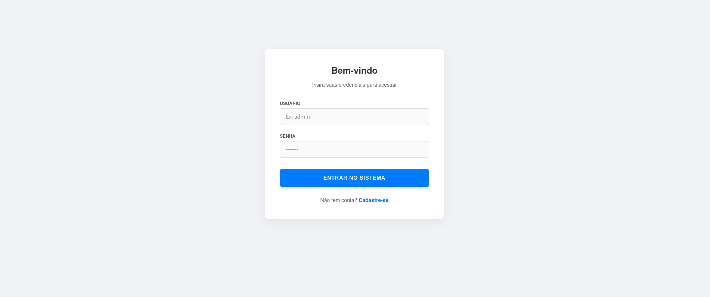
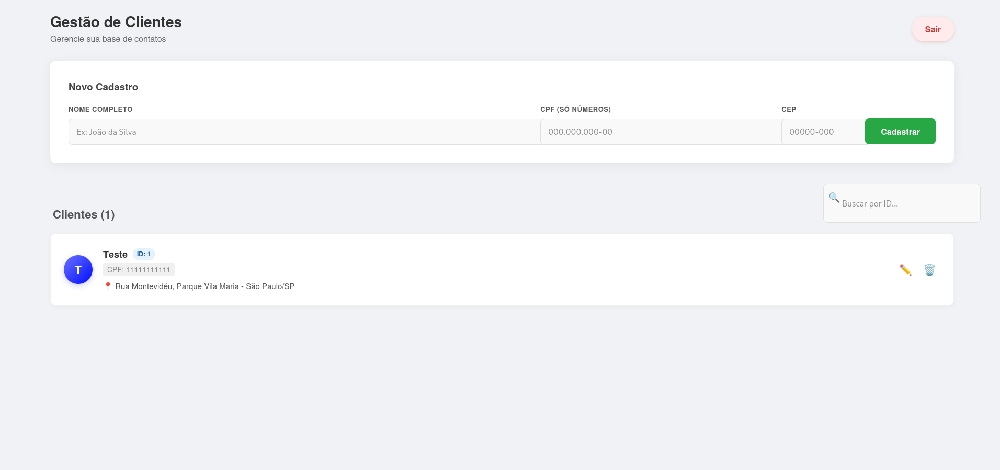

# Desafio Técnico - Sistema de Gestão de Clientes

### Esstrtura do projeto


Este projeto consiste em uma aplicação Full Stack desenvolvida para atender aos requisitos do desafio técnico. O sistema oferece uma solução completa para gestão de clientes com autenticação robusta, segurança via tokens e integração de serviços externos.


```text
desafio-tecnico/
├── docker-compose.yml
├── README.md
├── backend/
│   ├── Dockerfile
│   ├── mvnw
│   ├── pom.xml
│   └── src/main/java/com/luiz/avaliacao/
│       ├── AvaliacaoApplication.java
│       ├── config/
│       │   └── SwaggerConfig.java
│       ├── controller/
│       │   ├── AuthenticationController.java
│       │   └── ClientController.java
│       ├── domain/
│       │   ├── Address.java
│       │   ├── Client.java
│       │   ├── RefreshToken.java
│       │   └── User.java
│       ├── dtos/
│       │   ├── AuthenticationDTO.java
│       │   ├── ClientRequestDTO.java
│       │   ├── ClientResponseDTO.java
│       │   ├── LoginResponseDTO.java
│       │   ├── RefreshRequestDTO.java
│       │   └── RegisterDTO.java
│       ├── factory/
│       │   └── ClientFactory.java
│       ├── repository/
│       │   ├── ClientRepository.java
│       │   ├── RefreshTokenRepository.java
│       │   └── UserRepository.java
│       ├── security/
│       │   ├── SecurityConfig.java
│       │   ├── SecurityFilter.java
│       │   └── TokenService.java
│       └── service/
│           ├── AuthorizationService.java
│           └── RefreshTokenService.java
└── frontend/
    ├── Dockerfile
    ├── package.json
    ├── vite.config.js
    └── src/
        ├── pages/
        │   ├── Login.jsx
        │   └── Clients.jsx
        ├── App.jsx
        └── main.jsx          
```

## Funcionalidades Implementadas

###  Autenticação e Segurança (Spring Security + JWT)
- **Login e Registro:** Sistema de autenticação via E-mail/Login e Senha.
- **Tokens:** Geração de `Access Token` (curta duração) e `Refresh Token` (longa duração).
- **Refresh Automático:** O Frontend renova o token automaticamente sem deslogar o usuário.
- **Logout Seguro:** Invalidação real do Refresh Token no banco de dados.
- **Proteção de Rotas:** Apenas usuários autenticados acessam o CRUD.


### Gestão de Clientes (CRUD)
- **Cadastro Completo:** Nome, CPF e Endereço.
- **Integração ViaCEP:** Preenchimento automático de endereço ao digitar o CEP.
- **Validação de CPF:** Verificação de formato e dígitos.
- **Busca:** Filtragem dinâmica de clientes por ID.
- **Edição e Exclusão:** Gerenciamento total da base de clientes

## 🛠 Tecnologias Utilizadas

### Backend
- **Java 21** & **Spring Boot 3**
- **Spring Security** (Autenticação JWT)
- **Spring Data JPA** (Persistência)
- **H2 Database** (Banco em memória para fácil execução)
- **Bean Validation / Hibernate Validator** (Validação de dados e CPF)
- **Swagger / OpenAPI** (Documentação da API)

### Frontend
- **React.js** com **Vite**
- **Axios** (com Interceptors para Refresh Token)
- **React Router Dom** (Navegação)
- **CSS Modules** (Estilização responsiva e moderna)

### Infraestrutura
- **Docker** & **Docker Compose** (Orquestração de containers)

## 🚀 Como Executar o Projeto

Você tem duas opções para rodar a aplicação.

### Opção 1: Via Docker
Esta opção sobe o Backend e o Frontend simultaneamente em containers isolados, sem necessidade de configuração extra.

1. Certifique-se de ter o Docker instalado.

2. Na raiz do projeto, execute:

   **docker compose up --build**

3. Aguarde os logs indicarem que os serviços iniciaram.

4. Acesse a aplicação em: http://localhost:5173


### Opção 2: Execução Local (Manual)

1. Backend

- Abra o projeto em sua IDE de preferência (IntelliJ, VS Code, Eclipse).

- Navegue até o arquivo principal:

**backend/src/main/java/com/luiz/avaliacao/AvaliacaoApplication.java**

- Execute o arquivo clicando em Run (ou botão de Play).

- O servidor iniciará e você poderá acessar a página do swagger:

http://localhost:8080/swagger-ui/index.html

2. Frontend

- Abra um terminal na pasta frontend.

**npm install**

- Execute o projeto:

**npm run dev**

- Acesse em: http://localhost:5173

## Credenciais de Acesso (Login)

**Usuário: admin, Senha: 123**

## Documentação da API (Swagger)

- A documentação interativa dos endpoints está disponível no Swagger UI.

**Link de Acesso:** http://localhost:8080/swagger-ui.html


# Tela de Login



# Tela de clientes

